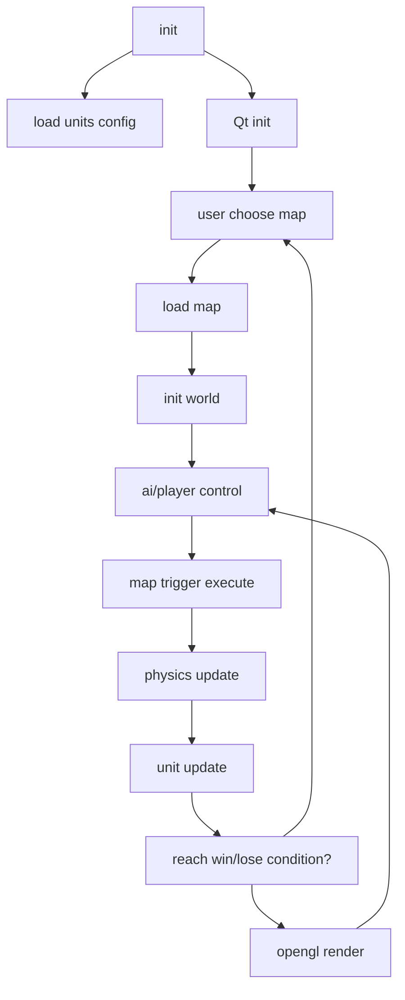

# stainless warfare game design document
by 王德宇 2024013267 2025/04/22

## Build && Run 
### windows
set your qt path in build.bat

```shell
.\build.bat
.\run.bat
```
### linux, macos

```shell
./build.sh
./run.sh
```

## Introduction
### features
this game has a lot of features, such as:

1. a lot of different units: tanks, soldiers, helicopters, police, common people, etc.
2. a lot of different maps: city, forest, desert, etc.  
you can even visit pokemon world. 原神world, etc.
3. separate game logic and game data. friendly for modding

### technique
* qt (qml qrc qopenglwidget)
* opengl (vao vbo shader)
* cmake (multiple projects,link,platform related process)

## proc graph


## Tech details

### render
game ui is rendered by Qt framework, and the game world is rendered by OpenGL.
actually the use of opengl is very simple, At the end of the project ,I learned other opengl tech ,which could have a better performance and more graceful code.
for example
1. use attribute instead of uniform to pass the transform of a sprite.(learned from Batch.java in libgdx)
2. semi_transparent texture, such as smoke effect, etc. should be blend properly , in a separate texture.
3. use post processing for better visual effect.
4. put many sprites into a single texture to reduce the number of texture switching.
### contact
units are seen as circles, and the collision detection is done by simple circle collision detection.  
to optimize the performance, we use spatial partitioning to reduce the number of collision detection.  
the forces are calculated to simulate crash harm to bio by vehicle.
### ai
complete melee ai ,pathfinding(astar algorithm for single unit, and flowfield algorithm for multiunits) ai, and shooting ai.
### unit config externally
Units are configured by .ini files and .png, and loaded by a simple parser.  
the whole system has such parts:
1. core
2. turret
3. projectile
4. effect
5. sound
6. arm
### map trigger design
I used traditional tilemap system, and the map is configured by .tmx files, and loaded by parser(tmxlite) .
By using tmx object layer, I implemented a trigger system, including:
* event:  
    1. unit detect
    2. time reach

* action
    1. dialog
    2. info
    3. camera move
    4. camera set
    5. unit add
    6. unit move
    7. unit remove

## Problems and solutions along the way
1. OpenGL startup    
install Nvidia driver on linux.  
set wsl to use windows gpu.  
add link opengl32 glu32 to run on windows.  
2. choose space partitioning method  
I gave up quadtree and use grid partitioning, after reading articles on the internet,
my goal is reducing times of collision detection, and grid partitioning is enough for this game.
3. multiple units pathfinding crashing between units  
if far ,use flowfield, if near go to target that are precomputed to avoid crashing.
4. pixel cord to world cord  
remake the whole game to unify the cord system.
5. adjust ui to fit the game  
learnt qss
6. perfect pixel  
opengl choose the nearest pixel to draw.
7. transparent png  
add opengl alpha blend function 
8. opengl performance  
turn to use vbo and vao
9. qt multimedia bug  
I need to copy QMultimedia.dll to the deploy-folder/plugin on windows. 
qt cannot make sound on my linux machine till now...
10. strange nan on windows
use assert to check every suspicious float number.  
learn msvc debug out to find the game run too fast (less than 1ms per frame) on my win machine, thus caused a zero division error.


## Reference
this game is inspired by the game "Rusted Warfare", most config files format are compatible with it.  
the most art resources are from "Rusted Warfare" modding community.  
tmx parse: tmxlite  
base64 decompression: zlib zstd  
framework: Qt6 opengl  


## Thoughts on oop and game 
oop is not a good choice for a complex game.Because Assemble is better than inheritance, in terms of maintainability and extensibility.
for example in src/game/Unit.cpp ,it is a big and messy class full of different logic ,relying heavily on other classes. I felt equally messy every time I want 
to add a new machinic to the game.Which is one of the reasons why I stopped this.Real game engine for example Unity uses ECS architecture, which is more flexible and maintainable.
No longer willing to continue oop design here. I stopped to explore real game dev
