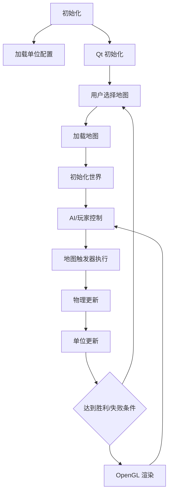

# 不锈钢铁战争游戏设计文档

作者：王德宇 2024013267 2025/04/22

## 构建与运行

* Windows
  在 build.bat 中设置你的 Qt 路径

* Linux, macOS

```shell
./build.sh
./run.sh
```

## 简介

### 特性

这款游戏有许多特性，例如：

1. 多种不同的单位：坦克、士兵、直升机、警察、普通人等。
2. 多种不同的地图：城市、森林、沙漠等。
   你甚至可以访问宝可梦世界、原神世界等。
3. 游戏逻辑与游戏数据分离，便于模组开发。

### 技术

* Qt (QML QRC QOpenGLWidget)
* OpenGL (VAO VBO Shader)
* CMake (多项目、链接、平台相关处理)

## 流程图



## 技术细节

### 渲染

游戏 UI 由 Qt 框架渲染，游戏世界由 OpenGL 渲染。
实际上，OpenGL 的使用非常简单，在项目结束时，我学习了其他 OpenGL 技术，这些技术可以提供更好的性能和更优雅的代码。
例如：

1. 使用属性而不是统一变量来传递精灵的变换。（从 libgdx 的 Batch.java 学习）
2. 半透明纹理，如烟雾效果等，应该正确混合，在单独的纹理中。
3. 使用后期处理以获得更好的视觉效果。
4. 将许多精灵放入单个纹理中以减少纹理切换次数。

### 碰撞

单位被视为圆形，碰撞检测通过简单的圆形碰撞检测完成。
为了优化性能，我们使用空间划分来减少碰撞检测次数。
计算力来模拟车辆对生物的撞击伤害。

### AI

完成近战 AI、路径查找（单个单位使用 A* 算法，多个单位使用流场算法）AI 和射击 AI。

### 外部配置单位

单位通过 .ini 文件和 .png 文件配置，并由简单解析器加载。
整个系统包含以下部分：

1. 核心
2. 炮塔
3. 弹药
4. 效果
5. 声音
6. Arm

### 地图触发器设计

我使用了传统的瓦片地图系统，地图通过 .tmx 文件配置，并由解析器（tmxlite）加载。
通过使用 tmx 对象层，我实现了一个触发器系统，包括：

* 事件：
    1. 单位检测
    2. 时间到达

* 动作：
    1. 对话
    2. 信息
    3. 摄像机移动
    4. 摄像机设置
    5. 添加单位
    6. 移动单位
    7. 移除单位

## 途中遇到的问题及解决方案

1. OpenGL 启动
   在 Linux 上安装 Nvidia 驱动。
   将 WSL 设置为使用 Windows GPU。
   在 Windows 上添加链接 opengl32 glu32。
2. 选择空间划分方法
   我放弃了四叉树，改用网格划分，阅读了网上的文章后，
   我的目标是减少碰撞检测次数，网格划分对于这个游戏来说已经足够。
3. 多个单位路径查找时单位之间的碰撞
   如果远，使用流场，如果近，前往预计算的目标以避免碰撞。
4. 像素坐标到世界坐标
   重新制作整个游戏以统一坐标系统。
5. 调整 UI 以适应游戏
   学习了 QSS。
6. 完美像素
   OpenGL 选择最接近的像素绘制。
7. 半透明 PNG
   添加 OpenGL Alpha 混合功能。
8. OpenGL 性能
   转向使用 VBO 和 VAO。
9. Qt 多媒体 bug
   我需要将 QMultimedia.dll 复制到部署文件夹的插件目录中。
   在 Linux 机器上，Qt 目前无法播放声音。
10. Windows 上的奇怪 NaN
    使用断言检查每个可疑的浮点数。
    学习 MSVC 调试输出，发现我的 Win 机器上的游戏运行速度太快（每帧少于 1 毫秒），从而导致除零错误。

## 参考

这款游戏受到了游戏 "Rusted Warfare" 的启发，大多数配置文件格式与其兼容。
大部分艺术资源来自 "Rusted Warfare" 模组社区。
tmx 解析：tmxlite
压缩：zlib zstd
框架：Qt6 OpenGL

## 对 OOP 和游戏的看法

对于复杂游戏来说，OOP 并不是一个好的选择。因为组合比继承在可维护性和可扩展性方面更好。
例如，在 src/game/Unit.cpp 中，它是一个庞大且混乱的类，充满了不同的逻辑，严重依赖其他类。每次我想在游戏中添加新机制时，我都感到同样混乱。这是我停止的原因之一。真正的游戏引擎例如
Unity 使用 ECS 架构，这更加灵活和可维护。
不再愿意继续这里的 OOP 设计。
